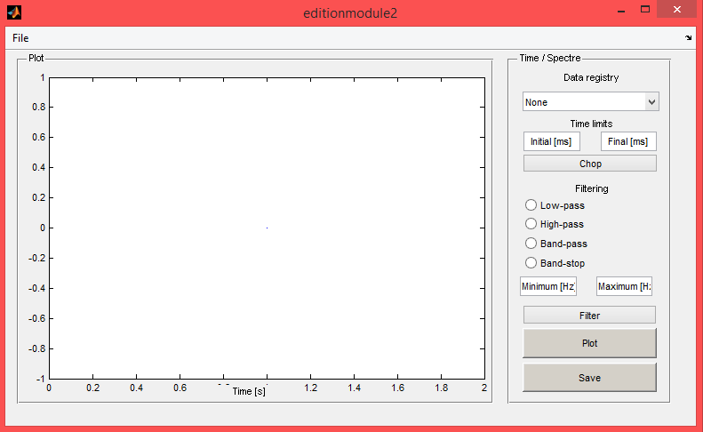
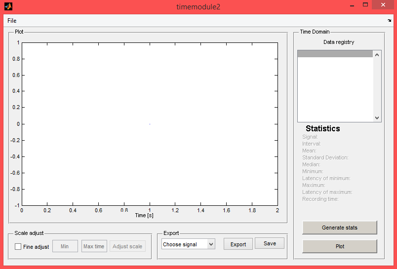

PROTOLIZE! 2
============

O PROTOLIZE! é uma ferramenta escrita em MATLAB para processamento de sinais de caráter biológico. Inicialmente [feito](http://repositorio.unb.br/bitstream/10482/4213/1/2009_SergioAndresCondeOcazionez.pdf) pelo professor [Sergio Ocazionez](http://lattes.cnpq.br/7159531395590165), que hoje se encontra no [Instituto do Cérebro da Universidade Federal do Rio Grande do Norte](http://www.neuro.ufrn.br/incerebro/), durante sua tese de mestrado na Universidade de Brasília, ele está sendo trabalhado no Laboratório de Neurociências e Comportamento da Universidade de Brasília.

O Protolize! está sendo escrito em MATLAB 2010 com auxílio do editor de textos [Atom](https://atom.io/). Esta documentação está sendo escrita em [Markdown](https://daringfireball.net/projects/markdown/) e sendo traduzido em HTML usando o script [markdown.lua](https://github.com/mpeterv/markdown) feito por [@mpeterv](https://github.com/mpeterv).

Pré-requisitos
--------------

Protolize! requer MATLAB R2008a rodando em um computador rodando Microsoft Windows Vista ou posterior com no mínimo 1GB RAM.

Instalação
----------

Para fazer o download do Protolize!, baixe o arquivo `protolize.zip` disponível no [repositório do GitHub](https://github.com/lab-neuro-comp/P2) e extraia seu conteúdo em um pasta específica. Inicie o MATLAB e vá à pasta onde você extraiu a sua versão do Protolize!. Dentro desta pasta, entre o comando `protolize`. Se não houver nenhum problema, o menu principal do Protolize! aparecerá, indicando que ele está pronto para uso.]

Esta documentação se refere à versão v0.2b do Protolize!

Outras informações relevantes
-----------------------------

Os sinais a serem processados deverão estar no formato `*.ASCII`. Para converter arquivos EDF em ASCII, há um ferramenta dentro do próprio Protolize! para isso. Certifique-se que há somente um sinal por arquivo ASCII para que o programa aceite a entrada.

Menu principal
==============

O menu principal contém 3 divisões: [`Protocols`](#protocols), [`Edition`](#edition) e [`Analysis`](#analysis). A partir delas, podemos acessar as diversas funcionalidades do Protolize! como descritas em suas respectivas sessões.

Além disso, há uma [barra de ferramentas](#toolbar) para acesso rápido de diversos ajustes do programa, do módulo de estudos e do arquivo de ajuda.

Barra de ferramentas
--------------------

No topo da janela principal, temos uma barra de ferramentas com as opções `File`, `Settings` e `Help`.

Em `File`, pode-se sair do programa ou do módulo; ou abrir ou salvar arquivos de acordo com o módulo que está sendo usado.

Em `Settings`, pode-se alterar diversos valores usados na análise de sinais, em especial a taxa de amostragem (chamada de `fs`); e os ritmos mentais usados no estudo em questão. O software define, por padrão, os seguinte ritmos mentais:

+ Delta: 0.5 a 3.5Hz
+ Theta: 3.5 a 7Hz
+ Alpha: 8 a 13Hz
+ Beta: 15 a 24Hz
+ Gamma: 30 a 70Hz

Também pode-se ajustar o caminho em disco para o EEGLAB, caso disponível no computador do usuário, para que ambos possam atuar no processamento de sinais. Estes valores podem ser ajustados de acordo com a necessidade do usuário, e todos os parâmetros disponíveis para ajuste ficam guardados em memória para uso futuro.

Em `Tools`, pode-se acessar:

+ O [módulo de estudos](#studies), que permite processar arquivos em lote usando o EEGLAB;
+ A ferramenta de análise de voz;
+ O separador de EMG e RGP;
+ O conversor de EDF para ASCII.

Em `Help`, tem-se acesso a este arquivo de ajuda que você está lendo.

Protocolos
==========

Por enquanto, temos 2 protocolos disponíveis: o TSST e o REFLEX.

<a name="edition"/>

Módulos de edição
=================

Para podermos visualizar e editar o sinal, há as ferramentas `Time/Spec` e `DWT`.

Time / Spectre
--------------

Este módulo fornece algumas ferramentas para edição de sinais no domínio do tempo. Em sua interface, pode-se notar que há ferramentas para cortar e para filtrar o sinal.

Inicialmente, carrega-se um sinal usando a opção `Open` no menu `File` da barra de ferramentas. Este sinal aparecerá na lista `Data registry`, no canto superior direito. Para mostrar este sinal na tela, aperte o botão `Plot`. Para cortar o sinal, digite os valores mínimo e máximo nas caixas `Min` e `Max`, respectivamente, e aperte o botão `Crop`. Para filtrar o sinal, existem 4 opções de filtros: passa-baixa, passa-alta, passa-banda ou rejeita-banda. Escolha o filtro e os intervalos de frequência desejados.

Para executar este módulo em separado, execute a função `editionmodule2`.

Discrete Wavelets Transform (DWT)
---------------------------------

O módulo DWT permite descontruir um sinal usando diversas transformadas de wavelets; fazer edições em seus coeficientes (isto é, em suas aproximações e detalhes); e reconstruir o sinal editado.

Este módulo permite que apenas um sinal seja trabalhado por vez. Para carregar um sinal na memória, abre o submenu `File` e selecione `Open` para escolher o arquivo com o sinal desejado. No canto superior esquerdo, há um painel com as opções de transformada de Wavelets: família de wavelets, tipo de wavelet e nível desejado. O botão `Calculate` determinará os coeficientes do sinal em memória.

Após a aplicação da transformada, pode-se escolher visualizar as aproximações ou os detalhes do sinal escolhido. Para editá-los, estão disponíveis as ferramentas no painel no lado direito. Nominalmente, pode-se substituir um coeficiente por um valor contínuo; e limitar os valores do coeficiente dentro de um intervalo.

Com os coeficientes editados, pode-se reconstruir o sinal clicando no botão `Reconstruct`. Para salvar o novo sinal, aperte o botão `Save`.

Para usar este módulo em separado, use o comando `dwtmodule2`. As funções relacionadas à transformada discreta de Wavelets estão disponíveis na pasta `math`; enquanto que as funções de edição dos coeficientes (que, por sinal, podem ser usadas para qualquer sinal) estão na pasta `util`.

Módulos de análise
==================

O Protolize! possui 4 ferramentas de análise de dados: análise no domínio do tempo (`Time domain`); análise por transformada de Fourier (`Fourier`); por transforma de Fourier de curta duração (`STFT`); e por transformada contínua de Wavelets (`CWT`).

Time Domain
-----------

A análise em domínio do tempo gera uma análise estatística do sinal em um período de tempo determinado. Selecione um sinal usando a opção `Open` no menu `File`. Este sinal pode ser cortado em um intervalo menor usando a opção `Crop`.

Para gerar uma análise deste sinal, aperte o botão `Generate Statistics`. A análise produzida poderá ser vista no painel ao lado direito, e poderá ser salva apertando o botão `Export statistics`.

Este módulo pode ser executado em separado usando o script `timemodule2`.

Fourier analysis
----------------

`TODO: ESCREVER DOCUMENTAÇÃO`

Short Time Fourier Transform (STFT)
-----------------------------------

`TODO: ESCREVER DOCUMENTAÇÃO`

Continuous Wavelet Transform (CWT)
----------------------------------

`O módulo ainda está em construção`

Ferramentas adicionais
======================

O Protolize! contém algumas ferramentas consigo para auxiliar no processamento de alguns sinais no mundo real.

Processamento de EEG
--------------------

O Protolize! contém uma ferramenta para realizar processamentos em lote utilizando o EEGLab. Esta ferramenta busca mostrar um passo-a-passo automatizado de um processamento usual de vários sinais de EEG em conjunto.

A entrada deste módulo é uma planilha Excel contendo, respectivamente, uma coluna para:

+ Arquivo EDF
+ Identificação do sujeito
+ Condição
+ Classe
+ Momento inferior de corte
+ Momento superior de corte

Análise de Voz
--------------

Esta ferramenta extrai os momentos iniciais de cada palavra em um sinal de voz em um arquivo WAV aplicando um _threshold_ no espectro de potência da gravação em questão. Permite remoção de falsos-positivos.

Separação de EMG-RGP
--------------------

Uma limpeza comum de se realizar neste laboratório é a separação dos sinais de EMG (registro eletromiográfico) e RGP (resposta galvânica da pele). Eles comumente aparecem no mesmo canal e é necessário separá-los.

Conversor de EDFs
-----------------

Esta á uma ferramenta criada para converter arquivos EDF em arquivos ASCII para serem usados no Protolize!, que requer, como entrada nos seus módulos, um sinal no formato ASCII por vez. Esta ferramenta também permite a conversão do EDF em questão para um único arquivo ASCII contendo todos os canais.
